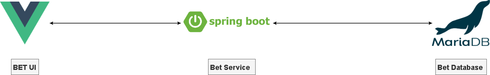

-----

## UI

URL: http://localhost/

-----
## Bet Service

### Place a Bet

Post: http://localhost:8181/api/v1/bet


### Retrieve Bets

Get: http://localhost:8181/api/v1/bet

-----

### Antifraud Service
Post: http://localhost:8182/api/v1/antifraud/check

-----

## Database Credentials

url:localhost

port:3312

Schema: bet

username: root

password: bet


-----

## Spin up containers

**On root folder execute the following**

```
docker-compose -f docker-compose.yml up -d
```
-----

